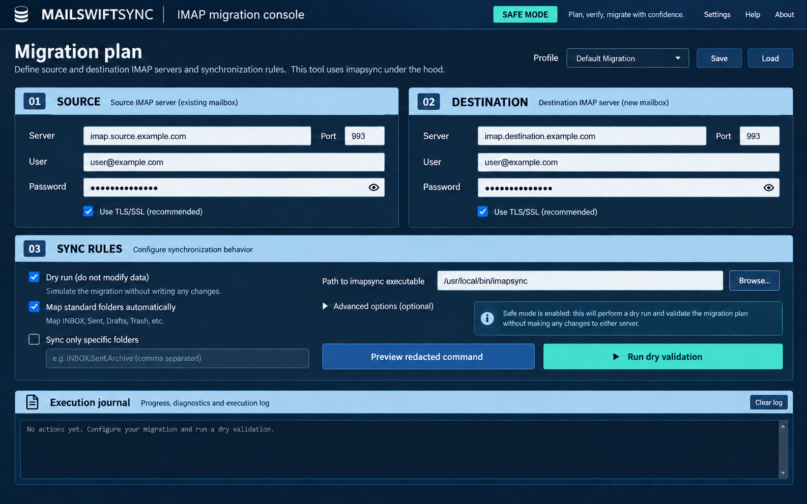

# MailSwiftSync

> A local-first mailbox migration control plane: plan, execute, verify, and audit bulk migrations with the best available engine.

[](https://github.com/itchyitchy123/MailSwiftSync/actions/workflows/ci.yml)
[](LICENSE)
[](https://www.rust-lang.org/)



> Documentation images are workflow illustrations, not pixel-accurate screenshots of the current egui interface. The shipped UI intentionally prioritizes explicit safety state, lifecycle visibility, redacted command review, and operator diagnostics.

MailSwiftSync is for hosting administrators, consultants, and MSPs moving multiple mailboxes between IMAP systems who need more than a command wrapper: a preflightable plan, controlled execution, restart-aware state, and evidence they can hand to a customer.

MailSwiftSync helps administrators and MSPs plan, execute, verify, and audit mailbox migrations. Select Dovecot native execution when the destination is Dovecot and administrative access is available; otherwise the conservative default uses a locally installed `imapsync` executable for arbitrary IMAP-to-IMAP migrations. Both paths provide a redacted plan, durable project state, phased execution, and an operator journal.

The product value is the control plane around the transfer engine: endpoint checks, pilot and cutover planning, mailbox scope, controlled execution, durable run records, and evidence-led verification. The central workflow is **Plan → Preflight → Execute → Verify → Audit**.

## Project status

MailSwiftSync is an early, usable 0.1 development release aimed at technical operators. The durable project ledger, dry-run safety gate, Dovecot/imapsync engine selection, streaming execution, and aggregate verification evidence are available today. Treat credential delivery, packaged installers, high-volume scheduling, message-level reconciliation, and unattended production operation as experimental or planned until the relevant release criteria are published.

Stable today:

- Dovecot-native `doveadm sync -1`/`backup` planning and execution, including remote `imapc` sources.
- `imapsync` fallback for arbitrary IMAP endpoints.
- CSV/XLS/XLSX batch queue with bounded operator-selected concurrency (1–16 workers), dry validation gates, live execution confirmation, cancellation, retries, and restart-visible child states.
- Explicit imapsync message and byte throttles for provider-friendly single-mailbox runs.
- Configurable per-process timeout (1–720 hours) so large mailboxes can run longer than the default while hung jobs remain bounded.
- Bounded transient retry policy for batch validation with cancellation-aware backoff.
- Actionable failure classification in worker output and durable run details: authentication, quota, transport, configuration, message, or unknown.
- Durable project phases, mailbox states, redacted events, run IDs, and verification evidence.
- Optional OS-keyring password references; keyring IDs are saved, while password material remains outside the profile and SQLite ledger.
- Dry-run default, explicit live confirmation, timeout, cancellation, and destructive-option warnings.
- Running jobs show elapsed time and can be cancelled with Escape; Advanced options include contextual guidance for per-process throttles.

Experimental or planned:

- Provider-specific OAuth/Modern Auth and unattended secret brokering.
- Native installers, signed releases, and cross-platform binary distribution.
- Maintenance windows, scheduler/API operation, and message-level verification for live batches.
- UIDVALIDITY-aware delta checkpoints and message-level mismatch reports.
- Published large-scale migration case studies and compatibility matrix.

## Why use this instead of the alternatives?

| Approach | Good at | What MailSwiftSync adds or avoids |
| --- | --- | --- |
| Raw `imapsync` or shell scripts | Flexible one-off transfers | Durable project state, safety gates, bounded queues, and exportable evidence |
| Native Dovecot `dsync` | Dovecot-to-Dovecot semantics and incremental sync | A guided plan, operator workflow, and verification around the native engine |
| Hosted migration SaaS | Broad provider coverage and managed execution | Local data flow, no per-mailbox SaaS fee, and inspectable local records |
| MailSwiftSync | Local IMAP migration operations | Uses proven engines while owning planning, preflight, recovery, and audit output |

Choose native Dovecot tooling directly when you already have a well-tested server-side workflow and do not need a desktop control plane. Choose MailSwiftSync when you need to coordinate and document a heterogeneous or multi-mailbox migration locally. It is deliberately not a hosted service and does not replace the engines' own mailbox semantics.

## Install

### 1. Install the selected migration engine

MailSwiftSync does not bundle or operate a remote sync service. Install the engine appropriate to the destination:

- **Dovecot destination:** provide `doveadm` on the destination host, either locally or through the configured SSH wrapper. The destination administrator must permit the `imapc` source connection.
- **Arbitrary IMAP destination:** install `imapsync` locally.

- **Ubuntu/Debian:** download the current `.deb` from the official imapsync distribution, then install it with `sudo apt install ./imapsync-*.deb`.
- **macOS:** install imapsync using the vendor distribution or your approved package-management workflow.
- **Windows:** install the official Windows package and enter the full path to `imapsync.exe` in MailSwiftSync.

Verify an imapsync installation in a terminal before configuring accounts:

```bash
imapsync --version
```

Consult the [official imapsync installation documentation](https://imapsync.lamiral.info/#install) for current packages and prerequisites.

MailSwiftSync itself uses Rustls with bundled WebPKI certificate roots for its authenticated IMAPS readiness probe. The probe validates the certificate, authenticates, refreshes capabilities after authentication, and inspects namespace/folder listing; it does **not** require OpenSSL development headers or `pkg-config` to build. Dovecot-native execution requires `doveadm` on the destination host (or an operator-managed wrapper/remote shell); the desktop does not install or configure Dovecot for you. Source port and source TLS mode are explicit plan fields, and long-running commands have a configurable 1–720 hour safety timeout plus an operator cancellation control. Plain and STARTTLS plans still use the selected engine's dry preflight for authentication validation.

### 2. Download or build MailSwiftSync

For released binaries, see [GitHub Releases](https://github.com/itchyitchy123/MailSwiftSync/releases). The release workflow produces portable Linux x86_64, Windows x86_64, and macOS arm64/x86_64 archives with SHA-256 checksums. Native installers and signed artifacts are not yet published; until then, verify the checksum and use the portable archive appropriate to your platform.

For contributors or users building from source:

```bash
cargo run --release
```

If `imapsync` is not on your PATH, enter its absolute path in **imapsync executable**. Begin with **Dry run** enabled and a test destination mailbox. Tagged releases build Linux, Windows, and macOS artifacts in GitHub Actions; if no release artifact is available for your platform, Rust/Cargo remains the developer installation path. Release artifacts include SHA-256 checksums.

### 3. First migration

1. Choose **Dovecot native** when the destination is managed by Dovecot and administrative access is available; otherwise choose **imapsync fallback**.
2. Enter source details on the left and destination details on the right.
   For imapsync, destination transport is typed separately: implicit TLS defaults to port 993 and STARTTLS defaults to port 143; enter an explicit destination port when the provider uses a nonstandard endpoint.
3. Leave **Dry run** selected and click **Preview safe command**.
4. Run validation and inspect the execution journal for successful access and folder mapping.
5. Only then disable Dry run and launch a live migration.

In imapsync mode, use **Project cockpit → Run authenticated IMAPS readiness probe** before a pilot to verify certificates and credentials, refresh post-auth capabilities such as QRESYNC, CONDSTORE, UIDPLUS, and SPECIAL-USE, and inspect namespace/folder listing. The probe is limited to dual-IMAPS plans; plain and STARTTLS plans use the selected engine's dry preflight for authentication validation. In Dovecot mode, dry preflight checks the remote `imapc` source and then runs destination-side `doveadm user` and mailbox-list checks; quota capacity still requires administrative review where it is not exposed by the configured Dovecot setup.

## Why MailSwiftSync exists

Bulk migration alone is not the differentiator: scripts and existing IMAP tools can already loop over accounts. MailSwiftSync is intended to answer the operational questions that matter during a migration window: which engine fits this destination, which accounts are ready, what failed, what needs a delta, and can the final result be demonstrated to another administrator?

## Security model

- **Local first.** The app does not relay mail data through a MailSwiftSync service; it invokes the selected local or destination-side engine only when you start a run.
- **No saved passwords.** Profiles retain only server, username, and selected options. Password fields begin empty on every launch.
- **Safe by default.** Dry mode adds `--dry`, which validates connectivity and proposed folder mapping without changing the destination. Runs have durable identities; on Unix, startup reconciliation terminates recorded interrupted process groups before exposing them for retry.
- **Single-owner state.** An exclusive application lock protects the project database. If another MailSwiftSync window is open, close that window rather than deleting the lock file; the second session cannot start a migration without durable ownership.
- **Redacted preview.** Passwords are hidden in the preview. imapsync live runs receive credentials through short-lived owner-only `--passfile1/--passfile2` files; local Dovecot runs use `MAILSWIFTSYNC_IMAPC_PASSWORD` through Dovecot's `$ENV:` expansion, while remote Dovecot runs still use a destination-side `imapc_password` override and should be treated accordingly.
- **Owned engine logging.** imapsync is invoked with `--nolog` by default, so its unmanaged `LOG_imapsync/` files do not become a second uncontrolled record of mailbox metadata. Use MailSwiftSync’s redacted journal and exported reports as the operational record.
- **Explicit transport policy.** imapsync plans force encrypted source/destination transport (`--ssl1/--ssl2` for IMAPS or `--tls1` for STARTTLS), request certificate verification with `SSL_verify_mode=1`, and reject expert overrides of those settings instead of allowing automatic cleartext fallback. Plain source transport is an explicit insecure warning and requires operator acknowledgement before any authenticated operation, including dry preflight; it is never presented as a verified TLS plan.

### Current security boundary

The desktop runner does not persist passwords. You may enter a password for the current session or load it through an OS-keyring ID. imapsync credentials are written to short-lived owner-only passfiles and removed after the child exits. Local Dovecot credentials use a child environment variable and Dovecot config expansion. Remote Dovecot execution is disabled by default because its current compatibility path uses `-o imapc_password=...`, which can expose the secret through process inspection on the destination host; an explicit acknowledgement is required to opt in. Provider-specific OAuth/Modern Auth and unattended secret brokering are not implemented yet. Never put real passwords in a committed CSV.

### Dovecot mode

 Dovecot mode configures the destination-side command in the form `doveadm ... sync -l 300 -1Ru DESTINATION imapc:`. This is an additive final-delta-safe default, and `-l 300` gives another dsync operation up to five minutes to release the mailbox lock. The Dovecot engine dialog lets you explicitly run `doveadm` locally or on the destination over SSH; an automatic mode remains for legacy profiles. After a live run, MailSwiftSync queries both sides with `doveadm mailbox status` and stores aggregate folder/message/virtual-size evidence. Enabling destination deletion selects `doveadm backup`, which makes the destination mirror the source and can remove destination-only mail. Dry preflight performs a non-mutating `imapc` mailbox listing against the source plus destination user and mailbox-list checks; it is a readiness check, not proof that the full migration will succeed.

## Verification

Verification is a primary product feature, not a process-exit decoration. After a live run, the project ledger records the available source/destination folder counts, message counts, virtual sizes, failures, warnings, and evidence level. A successful process with incomplete evidence remains pending review. Exact aggregate matches can be accepted as `Aggregate match`, but they are not message-level reconciliation and are intentionally not presented as 100% proof. Aggregate mismatches are surfaced for review rather than assigned a reassuring partial score. Export both human-readable Markdown and secret-free structured JSON project reports. Live execution is also bound to the exact secret-free plan captured by a successful dry preflight, so changing endpoints, users, engine, TLS, or controlled options requires preflight again.


The on-screen execution journal is intentionally capped at 10,000 lines for desktop stability; the redacted durable event ledger remains the longer-lived audit record.

```bash
cargo fmt --check
cargo clippy --all-targets -- -D warnings
cargo test --all-targets
cargo build --release
```

## Documentation

MailSwiftSync is distributed under the [MIT License](LICENSE).

Begin with the [MailSwiftSync Wiki](docs/wiki/Home.md) for illustrated, step-by-step setup and migration guidance.

For the durable project, phase, and verification model, see the [control-plane architecture](docs/architecture.md).

For batch work, see [Bulk migrations from CSV or Excel](docs/wiki/Bulk-migrations.md) and start from the included template. Never commit a populated spreadsheet containing passwords.

See the [release-readiness criteria](docs/release-readiness.md) for the boundary between the current operator-focused 0.1 release and production-ready 1.0 work.

## Advanced options

Click **Advanced options** to add common imapsync flags with understandable descriptions: internal-date sync, UID matching, cache usage, fast I/O, and size-mismatch tolerance. The `--delete2` control is visually marked destructive because it can remove destination messages that do not exist on the source.

The **Extra imapsync options** field accepts only a small allowlist of non-connection tuning options (`nofoldersizes`, `skipcrossduplicates`, `maxlinelength`, timeout/retry controls, sleep controls, subscription, and debug flags). Endpoint, credential, TLS, dry-run, destructive deletion, logging, and unknown options are rejected. Test every change using Dry run first. The command preview shows the final arguments with passwords redacted. Bulk spreadsheets cannot provide this field.

## Packaging

Run `scripts/package.sh` from anywhere inside the checkout to create a host-native tarball and SHA-256 checksum in the repository's `dist/` directory. Signing and platform-native installers require your own release keys and distribution policy.
