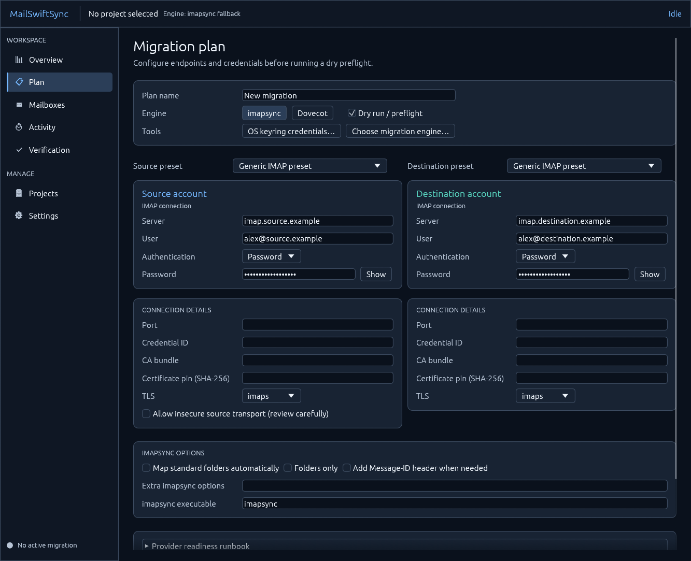
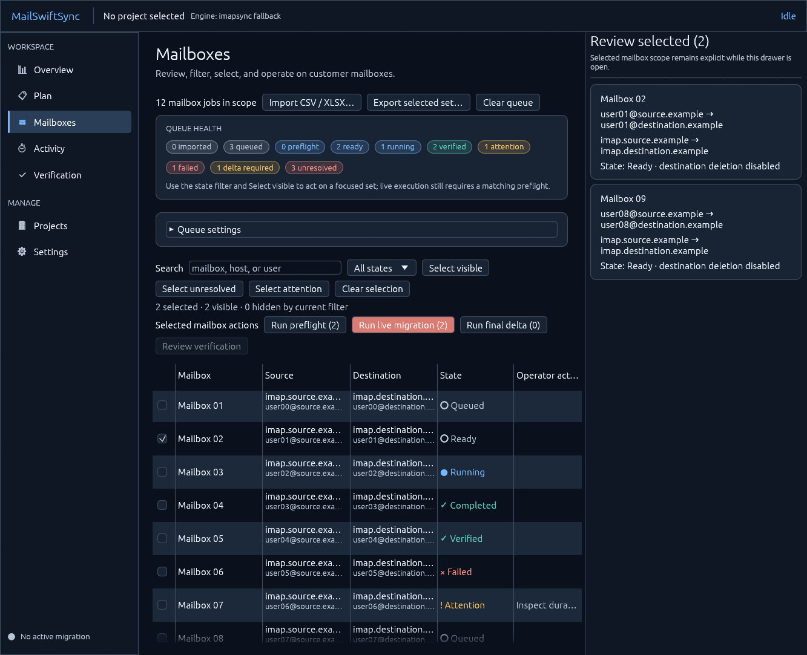

# MailSwiftSync

> A local-first mailbox migration control plane: plan, execute, verify, and audit bulk migrations with the best available engine.

[](https://github.com/cyberducttape/MailSwiftSync/actions/workflows/ci.yml)
[](LICENSE)
[](https://www.rust-lang.org/)



> Documentation images are current workflow previews, not pixel-accurate screenshots of the egui interface. They illustrate the intended operator flow and emphasize explicit safety state, lifecycle visibility, redacted command review, and diagnostics.

> [!IMPORTANT]
> **Your source mailbox is never deleted from or modified.** MailSwiftSync only ever writes to the destination; there is no option anywhere in the interface, CLI, or Extra imapsync options field to delete or alter source messages, and destructive-deletion flags are explicitly rejected from that field. Two plan choices can remove state that exists only on the **destination**: imapsync's `--delete2` (off by default), which removes destination messages missing from the source, and the Dovecot **Initial mirror** and **Incremental mirror** strategies, which run `doveadm backup` and force the destination to match the source, removing or replacing destination-only messages and mailboxes. MailSwiftSync derives one destination mutation policy from the whole plan (additive, merge preserving destination, destination mirror, or delete destination-only messages) and uses it everywhere: the Plan page, preflight review, single and batch live confirmations, the Mailboxes review drawer, run records, operator reports, and the CLI. Any plan that can remove destination state is shown in red and requires an explicit acknowledgement before a live run: a checkbox in the GUI, or `--acknowledge-destination-loss` for `headless live`, `headless batch-live`, and `supervise`. MailSwiftSync cannot prove the destination is empty beforehand, because Dovecot warns against opening the target mailbox store before the first sync. Any future source-deletion capability would be off by default and called out in red the same way.

MailSwiftSync is for hosting administrators, consultants, and MSPs moving multiple mailboxes between IMAP systems who need more than a command wrapper: a preflightable plan, controlled execution, restart-aware state, and evidence they can hand to a customer.

MailSwiftSync is a local-first migration control plane for auditable mail cutovers. It helps administrators and MSPs plan, execute, verify, and audit mailbox migrations. Select Dovecot native execution when the destination is Dovecot and administrative access is available; otherwise the conservative default uses a locally installed `imapsync` executable for arbitrary IMAP-to-IMAP migrations. The transfer engines are workers; MailSwiftSync owns admission, credential boundaries, execution ownership, resumption, verification, exceptions, auditability, and proof.

The product value is the control plane around the transfer engine: endpoint checks, pilot and cutover planning, mailbox scope, controlled execution, durable run records, and evidence-led verification. The central workflow is **Plan → Preflight → Execute → Verify → Audit**.

The desktop UI includes a persisted **Settings → Appearance → Color pack** selector. It includes the WayExpand-inspired Default, Classic Green, Classic Amber, Classic White, Retro 80s Neon, High Contrast, Terminal Blue, and Commodore 64 palettes, plus Windows 95 and Windows 3.1 desktop-inspired themes. The Default pack retains the Dark/Light toggle; the retro packs use their own fixed palettes.

## Migration assurance snapshots

For inventories not yet collected by the mailbox controller, `migrateaudit`
compares two JSON snapshots and writes a deterministic assurance report:

```text
mailswiftsync migrateaudit source.json destination.json assurance-report.json
```

This command has an alias: `mailswiftsync audit` is equivalent.

Each top-level JSON array is a resource category, such as `mailboxes`,
`folders`, `messages`, `permissions`, `databases`, `dns`, or `ssl`. Records
are matched by typed identities where a schema is known: messages use account,
folder, UIDVALIDITY, and UID; mailboxes use account and mailbox; DNS records
use zone, owner, type, and value; files use normalized paths; and databases use
server, database, and object. Unknown categories use a heuristic identity and
are labeled `identity_policy: "heuristic"` in the report. Equal identities
with different content are reported as `modified`, and absent records as
`missing` or `extra`.

The command prints a one-line result, writes per-category counts and
source/destination SHA-256 values, and exits 1 when any difference exists.
Detail records are capped at 1,000 per category; `detail_count`,
`details_truncated`, and `details_omitted` disclose that cap while aggregate
counts remain complete. The current comparator materializes and sorts the
snapshots in memory, so it is intended for bounded inventories, not yet for
multi-million-message assurance. Large-scale assurance needs an indexed,
restartable SQLite-backed comparison path before it can be treated as a
scale-ready capability. Each supplied snapshot is capped at 256 MiB before
parsing; larger inputs must use that future staged comparison path.
The report can be checked with `verify` and signed with `sign`. It proves
equality of the supplied snapshots; snapshot completeness remains the
responsibility of the collector and is stated in the report.

For a targeted retry or remediation pass, batch execution accepts an explicit
durable job-ID set:

```text
mailswiftsync headless state.db batch-live --mailboxes job-123,job-456
```

Unknown IDs are rejected, and the command never expands a targeted request to
the whole queue. The resulting customer proof now includes exact mailbox
counts, exception counts, and aggregate missing/extra/modified message totals.

## Project status

MailSwiftSync is an early, usable 0.1 development release aimed at technical operators. The durable project ledger, dry-run safety gate, Dovecot/imapsync engine selection, streaming execution, aggregate evidence, bounded metadata-level reconciliation, and explicitly opt-in bounded body-content proof for encrypted imapsync runs are available today. Treat credential delivery, provider qualification, packaged installers, and unattended production operation as experimental or planned until the relevant release criteria are published. Portable release archives are signed/notarized when the release signing environment is configured. Linux releases also include a signed Debian package; RPM and native Windows/macOS installers are not currently shipped.

Stable today:

The default live imapsync result is labeled `Metadata reconciled — message bodies not compared`; only an explicitly enabled forensic profile can produce `body_hash` evidence.

- `imapsync` fallback for arbitrary IMAP endpoints.
- CSV/XLSX batch queue with bounded operator-selected concurrency (1–16 workers), explicit worksheet selection for workbooks, preflight gates, live execution confirmation, cancellation, retries, and restart-visible child states. Legacy XLS imports are disabled because the parser cannot be bounded safely before worksheet materialization.
- Explicit imapsync message and byte throttles for provider-friendly single-mailbox runs.
- Configurable per-process timeout (1–720 hours) so large mailboxes can run longer than the default while hung jobs remain bounded.
- Bounded transient retry policy for batch validation with cancellation-aware backoff.
- Actionable failure classification in worker output and durable run details: authentication, quota, transport, configuration, message, or unknown.
- Durable project phases, mailbox states, redacted events, run IDs, and verification evidence.
- Metadata-level message mismatch reports with durable missing, extra, and modified counts; optional encrypted-imapsync forensic mode can additionally hash every fetched RFC822 body within explicit per-message and total-byte bounds.
- Optional OS-keyring password references; keyring IDs are saved, while password material remains outside the profile and SQLite ledger.
- Dry-run default, explicit live confirmation, timeout, cancellation, and destructive-option warnings.
- The Plan page shows provider-pair qualification state and a pre-migration simulation of scope, destination mutation behavior, engine, mapping, authentication, observed readiness risks, and known inventory. Hosted-provider pairs remain visibly unqualified until live qualification evidence exists; unknown message counts and data volume are not estimated.
- Running jobs show elapsed time and can be stopped through an explicit confirmation; Advanced options include contextual guidance for per-process throttles.

Experimental or planned:

- Native Dovecot execution is implemented and wired, but remains experimental
  until its integration fixture and recovery scenarios pass in CI. The
  capability manifest tracks this separately from code and wiring status.
- Unattended secret brokering beyond the OS keyring, and an in-GUI provider
  sign-in. Consent itself is available from the CLI:
  `mailswiftsync oauth-authorize` runs the authorization-code flow with PKCE
  against the operator's registered application and stores the refresh
  configuration that live launches use. It has not yet been qualified against
  live Google or Microsoft tenants.
- Native installers. Portable signed archives and cross-platform binary distribution are available when release signing credentials are configured.
- A scheduler/API that can survive the desktop closing. (`supervise` provides a foreground, maintenance-window-aware batch controller; body hashing is currently an explicit per-mailbox opt-in rather than a default batch mode.)
- UIDVALIDITY-aware delta checkpoint binding is implemented for native Dovecot; encrypted-imapsync verification persists bounded metadata pages, body fingerprints, and UID cursors across controller interruption, while provider qualification and large-mailbox recovery evidence remain outstanding.
- Published large-scale migration case studies and compatibility matrix.

The current tested scope and explicit gaps are tracked in the
[compatibility matrix](docs/compatibility-matrix.md); an entry is not treated
as supported until its dry/live/recovery/evidence gates are complete.

Provider qualification procedures and evidence-generation tools for Gmail,
Microsoft 365, Fastmail, and disposable Dovecot fixtures are maintained in
the source repository; they are not part of the normal operator distribution.

## Why use this instead of the alternatives?

| Approach | Good at | What MailSwiftSync adds or avoids |
| --- | --- | --- |
| Raw `imapsync` or shell scripts | Flexible one-off transfers | Durable project state, safety gates, bounded queues, and exportable evidence |
| Native Dovecot `dsync` | Dovecot-to-Dovecot semantics and incremental sync | A guided plan, operator workflow, and verification around the native engine |
| Hosted migration SaaS | Broad provider coverage and managed execution | Local data flow, no per-mailbox SaaS fee, and inspectable local records |
| MailSwiftSync | Local IMAP migration operations | Uses proven engines while owning planning, preflight, recovery, and audit output |

Choose native Dovecot tooling directly when you already have a well-tested server-side workflow and do not need a desktop control plane. Choose MailSwiftSync when you need to coordinate and document a heterogeneous or multi-mailbox migration locally. It is deliberately not a hosted service and does not replace the engines' own mailbox semantics.

## Install

### 1. Install the selected migration engine

MailSwiftSync does not bundle or operate a remote sync service. Install the engine appropriate to the destination:

- **Dovecot destination:** provide `doveadm` on the local controller host. Native Dovecot execution is local-only until a secret-safe broker is implemented; the destination administrator must permit the `imapc` source connection.
- **Arbitrary IMAP destination:** install `imapsync` locally.

MailSwiftSync's trusted imapsync verification contract is qualified only for
**imapsync 2.314**. Newer or unknown versions may transfer mail, but their
output is fail-closed and cannot become trusted MailSwiftSync verification
evidence. Use the exact qualified version when migration proof matters.

- **Ubuntu/Debian:** download the **2.314** `.deb` from the official imapsync distribution, then install it with `sudo apt install ./imapsync-*.deb`. Do not substitute the current package when trusted verification is required.
- **macOS:** install imapsync using the vendor distribution or your approved package-management workflow.
- **Windows:** install the official Windows package and enter the full path to `imapsync.exe` in MailSwiftSync.

Verify an imapsync installation in a terminal before configuring accounts:

```bash
imapsync --version
```

Confirm that the command reports **2.314** before starting a migration. If the
**Activity** log says that the engine is not qualified, treat the run as
transfer-only and review it manually; it is not a verified migration.

Consult the [official imapsync installation documentation](https://imapsync.lamiral.info/#install) for current packages and prerequisites.

MailSwiftSync itself uses Rustls with bundled WebPKI certificate roots for its authenticated IMAP readiness probe. Comprehensive preflight validates certificates, authenticates, refreshes capabilities after authentication, and inspects namespace/folder listing; the immediate live-launch probe repeats only TLS, authentication, post-authentication capabilities, and a NOOP, so large folder inventories are not enumerated before every mailbox launch or retry. It does **not** require OpenSSL development headers or `pkg-config` to build. Dovecot-native execution requires local `doveadm` on the destination host; remote Dovecot execution is unavailable until a secret-safe broker is implemented. The desktop does not install or configure Dovecot for you. Source port and source TLS mode are explicit plan fields, and long-running commands have a configurable 1–720 hour safety timeout plus an operator cancellation control. Plain plans remain limited to the selected engine's preflight and require explicit cleartext acknowledgement.

### 2. Download or build MailSwiftSync

For released binaries, see [GitHub Releases](https://github.com/cyberducttape/MailSwiftSync/releases). The release workflow produces portable Linux x86_64, Windows x86_64, and macOS arm64/x86_64 archives plus a Linux Debian package with SHA-256 checksums, platform signing/notarization when the release signing environment is configured, a Rust CycloneDX SBOM and final-image SPDX SBOM, and GitHub build-provenance attestations. Every release tag must exactly equal `v` plus Cargo's package version (currently `v0.1.0-alpha.1`), so prerelease identifiers remain part of the binary and report provenance.

For contributors or users building from source:

```bash
cargo run --release
```

Linux packaging targets for a stable release are tracked in the repository's
release-readiness plan: signed Debian/Ubuntu and RHEL-family repositories,
x86_64/ARM64 builds, shell completions, and deterministic upgrade/uninstall
behavior. The alpha release provides a signed Debian package for the Linux
host architecture, portable archives, and the pinned container image; RPM and
APT repository metadata remain future release work.

If `imapsync` is not on your PATH, enter its absolute path in **imapsync executable** in the **imapsync options** card on the **Plan** page. Begin with **Dry run / preflight** checked and a test destination mailbox. Tagged releases build Linux, Windows, and macOS artifacts in GitHub Actions; if no release artifact is available for your platform, Rust/Cargo remains the developer installation path. Release artifacts include SHA-256 checksums.

### 3. First migration

1. Choose **Dovecot native** when the destination is managed by Dovecot and administrative access is available; otherwise choose **imapsync fallback**.
2. On **Plan**, enter source details in the left card and destination details in the right card.
   For imapsync, destination transport is typed separately: implicit TLS defaults to port 993 and STARTTLS defaults to port 143; enter an explicit destination port when the provider uses a nonstandard endpoint.
3. Leave **Dry run / preflight** checked and click **Preview command** to review the redacted command.
4. Click **Run preflight** and inspect the **Activity** log for successful access and folder mapping.
5. Only then clear **Dry run / preflight**, click **Start live migration**, and complete the confirmation.

In imapsync mode, click **Run authenticated readiness probe** on the **Plan** page before a pilot to verify certificates and credentials, refresh post-auth capabilities such as QRESYNC, CONDSTORE, UIDPLUS, and SPECIAL-USE, and inspect namespace/folder listing. The visible capability-discovery dialog presents the comprehensive IMAPS inventory probe; live admission performs a lighter certificate-verified authentication/NOOP probe for encrypted plans and does not repeat full folder discovery. Plain plans use the selected engine's preflight only after explicit cleartext acknowledgement. In Dovecot mode, preflight lists the remote `imapc` source and checks the local destination userdb with `doveadm user`; it deliberately avoids enumerating the target mailbox store before the first sync because early access can cause GUID/UIDVALIDITY conflicts or make Dovecot synchronization fail. Quota capacity still requires administrative review where it is not exposed by the configured Dovecot setup.

## Why MailSwiftSync exists

Bulk migration alone is not the differentiator: scripts and existing IMAP tools can already loop over accounts. MailSwiftSync is intended to answer the operational questions that matter during a migration window: which engine fits this destination, which accounts are ready, what failed, what needs a delta, and can the final result be demonstrated to another administrator?

## Security model

- **Local first.** The app does not relay mail data through a MailSwiftSync service; it invokes the selected local or destination-side engine only when you start a run.
- **No saved passwords.** Profiles retain only server, username, and selected options. Password fields begin empty on every launch.
- **Safe by default.** Dry mode adds `--dry`, which validates connectivity and proposed folder mapping without changing the destination. Runs have durable identities; on Unix, startup reconciliation terminates recorded interrupted process groups before exposing them for retry.
- **Single-owner state.** An exclusive application lock protects the project database. If another MailSwiftSync window is open, close that window rather than deleting the lock file; the second session cannot start a migration without durable ownership.
- **Descendant containment.** Linux uses owned sessions/process groups and Windows uses a kill-on-close Job Object for engine descendants. macOS deliberately fails closed when it cannot prove ownership and should use a Unix admin host for high-stakes windows.
- **Redacted preview.** Passwords and OAuth access tokens are hidden in the preview. imapsync live runs receive password credentials through short-lived owner-only `--passfile1/--passfile2` files and OAuth credentials through private `--oauthaccesstoken1/--oauthaccesstoken2` token files. Local Dovecot runs use a private temporary config that includes the selected destination config and reads the source password from an owner-only file; the password is not passed in `doveadm` arguments. Engines start from an empty environment plus a short allowlist (`PATH`, locale, time zone, temporary directories, home/user, TLS trust-store locations, `PERL5LIB`, and Windows system essentials), so cloud keys, tokens, and other secrets in MailSwiftSync's own environment never reach imapsync or `doveadm`; `doveadm` also runs without `-k`. Remote Dovecot execution is unavailable until a secret broker can deliver credentials without destination-host process exposure.
- **Owned engine logging.** imapsync is invoked with `--nolog` by default, so its unmanaged `LOG_imapsync/` files do not become a second uncontrolled record of mailbox metadata. Use MailSwiftSync’s redacted journal and exported reports as the operational record.
- **Explicit transport policy.** imapsync plans force encrypted source/destination transport (`--ssl1/--ssl2` for IMAPS or `--tls1` for STARTTLS), request certificate verification with `SSL_verify_mode=1`, and reject expert overrides of those settings instead of allowing automatic cleartext fallback. Plain source transport is an explicit insecure warning and requires operator acknowledgement before any authenticated operation, including dry preflight; it is never presented as a verified TLS plan.

### Current security boundary

The desktop runner does not persist passwords or OAuth access tokens. For imapsync, choose **OAuth 2.0 / XOAUTH2** per endpoint and enter a currently valid access token, or load it through an OS-keyring ID; live runs write it to a short-lived owner-only token file that imapsync reads without exposing it in argv. The readiness probe performs the same XOAUTH2 authentication before live admission. The operator registers their own OAuth application with the provider; there is no in-app "sign in with Google/Microsoft" button, but `mailswiftsync oauth-authorize` completes consent in a browser with PKCE and stores the initial refresh configuration (see [OAUTH_SETUP.md](OAUTH_SETUP.md#authorize-with-mailswiftsync)). A refresh token obtained through the provider's own tooling can be entered instead. Once that refresh token, the token endpoint, and the client ID/secret are stored under an OS-keyring ID (in the OAuth keyring dialog's "Automatic OAuth refresh" section, separate from the plain credential entry), MailSwiftSync exchanges it for a fresh access token before every live launch, including each mailbox in a batch queue, so a long unattended run does not stall on a token that expired while it waited. Refresh-token rotation is followed automatically. Without a configured refresh entry, behavior is unchanged: operators obtain and rotate tokens by hand. Dovecot native execution currently supports password authentication only. Remote Dovecot execution is unavailable until a secret broker can deliver credentials without destination-host process exposure. Never put real passwords, tokens, refresh tokens, or client secrets in a committed CSV.

### Dovecot mode

Dovecot mode configures the destination-side command using the selected migration strategy: initial/incremental mirrors use `doveadm backup`, while final preservation and destination-already-active passes use `doveadm sync -1`. **Destination-already-active is an advanced, explicitly acknowledged mode:** Dovecot documents that `sync -1` merging does not work perfectly in every case and says its use should be limited; review conflicts and repeat final synchronization until dsync exits 0 before treating cutover as complete. Migration can impose unexpectedly high load on the source, and Dovecot does not provide a way to throttle synchronization. See the [Dovecot sync documentation](https://doc.dovecot.org/main/core/man/doveadm-sync.1.html) and [migration caveats](https://doc.dovecot.org/main/core/admin/migration.html). Initial `backup` can require replacing destination `INBOX`; a Maildir target may refuse that operation (`INBOX can't be deleted`). The automated native-Dovecot lab covers mdbox, not Maildir, so test the exact destination storage format and existing mailbox state before using this strategy. The last committed state is reused for subsequent live passes, while the first pass supplies an empty state; `-l 300` gives another dsync operation up to five minutes to release the mailbox lock. A newly emitted state is committed atomically with the child result, and dry preflight remains non-stateful. Native Dovecot execution is local-only; saved profiles that request the retired remote-SSH path are rejected rather than silently converted. After a live run, MailSwiftSync queries both sides with `doveadm mailbox status` and stores aggregate folder/message/virtual-size evidence. Dovecot exit code 2 is retained as delta-required and the final pass should be repeated until exit code 0. Dry preflight lists source mailboxes through `imapc` and checks the destination userdb with `doveadm user`, but deliberately does not enumerate the destination mailbox store before the first sync; Dovecot warns that opening target mailboxes early can cause GUID/UIDVALIDITY conflicts or make synchronization fail. This readiness check is not proof that the full migration will succeed.

## Verification

Verification is a primary product feature, not a process-exit decoration. After a live run, the project ledger records the available source/destination folder counts, message counts, virtual sizes, failures, warnings, and evidence level. A successful process with incomplete evidence remains pending review. Exact aggregate matches are labeled `Aggregate match — not message-body proof`; they are not message-level reconciliation and are intentionally not presented as 100% proof. Aggregate mismatches are surfaced for review rather than assigned a reassuring partial score. Export both human-readable Markdown and secret-free structured JSON project reports. Live execution is also bound to the exact secret-free plan captured by a successful dry preflight, so changing endpoints, users, engine, TLS, or controlled options requires preflight again.

Current live verification reaches **Level 2 — Aggregate reconciliation — not message-body proof** for
native Dovecot runs and **metadata-level message reconciliation** for encrypted
imapsync runs when the independent IMAP fetch succeeds. An explicit forensic
profile can instead fetch and SHA-256 hash RFC822 bodies on both sides, within
configured per-message and total-byte bounds; that evidence is labeled
`body_hash` and fails closed on incomplete coverage or resource limits. The
default metadata path compares Message-ID, INTERNALDATE, and RFC822.SIZE across
every selectable folder and is surfaced as `Metadata reconciled — message bodies
not compared`. A successful process
without usable evidence is Level 0 — process completed, verification incomplete.
The verifier fails closed for `--automap`, `--justfolders`, `--addheader`,
disabled internal-date sync, or `--allowsizemismatch` plans until their
semantics can be represented without overstating exact evidence. New profiles
default to automapping off; live runs using automap are rejected before transfer
because the engine's resolved mapping is not yet persisted as an immutable
verification input. It also enforces a conservative estimated
bounded UID-window enumeration; it no longer materializes a mailbox-wide
`UID SEARCH ALL` response. Fetched metadata is staged in a private SQLite
database and reconciled in bounded batches, so the live path does not retain
both account-wide message maps in Rust. Mismatch detail remains bounded; the
opt-in body path deliberately loads only bounded metadata maps after hashing,
and live large-provider qualification remains outstanding. The current
implementation ceilings are 1,000,000 messages per endpoint for metadata
reconciliation and 100,000 messages per endpoint plus 8 GiB of combined
source/destination body bytes for body proof (512 MiB default). These are not
provider-qualified capacity claims; benchmark scope and limitations are in the
[verification envelope](docs/verification-envelope.md).

The structured project report is a portable Migration Proof: it contains a deterministic `proof_digest` covering the report's semantic JSON content. Verify an archived or customer-shared report independently with:

```bash
mailswiftsync verify path/to/mailswiftsync-project-report.json
```

This command does not contact either mailbox or require the application database. It verifies report integrity only; it does not upgrade aggregate evidence into message-level reconciliation. For authenticity, sign the report with an owner-only Ed25519 PKCS#8 key and verify with the pinned public key:

```text
mailswiftsync sign path/to/mailswiftsync-project-report.json path/to/operator-key.pk8 migration-change-2026-09
mailswiftsync verify path/to/mailswiftsync-project-report.json <public-key-hex>
```

Unsigned reports remain supported as integrity-only artifacts when no key is given. With a pinned public key, `verify` fails on an unsigned report, so removing a signature cannot pass as a verified one. The public key is embedded for portability, but a trust pin is required to establish that the signer is the expected operator or organization.

Run manifests also retain the engine version reported by `imapsync` or
`doveadm` when available; older wrappers that do not support `--version` are
reported as unavailable rather than inferred.

While the GUI is closed, create a consistent, integrity-checked ledger backup:

```text
mailswiftsync backup /path/to/state.db /path/to/state-backup.db
```

The command takes the same instance lock as the GUI, refuses to overwrite an existing destination, and verifies SQLite integrity before reporting success. Backups contain durable project metadata and evidence, never mailbox passwords.

To restore a verified backup, stop every controller using the ledger and run:

```text
mailswiftsync restore /path/to/state-backup.db /path/to/state.db
```

The source is validated before installation. If the destination already exists,
it is preserved as a unique `*.pre-restore-<id>.db` rollback artifact.

For automation and incident response, the same durable ledger can be inspected
or recovered without opening the GUI:

```text
mailswiftsync status /path/to/state.db
mailswiftsync status /path/to/state.db <project-id>
mailswiftsync fleet-status /path/to/ledger-directory
mailswiftsync doctor [/path/to/state.db] [--strict]
mailswiftsync recover /path/to/state.db
mailswiftsync support-bundle /path/to/state.db /path/to/support-bundle.json
mailswiftsync customer-proof /path/to/state.db /path/to/customer-proof.json
mailswiftsync notify-webhook /path/to/state.db https://hooks.example.com/in/abc123
mailswiftsync supervise /path/to/state.db [poll-seconds] [idle-polls] [maintenance-window]
mailswiftsync headless /path/to/state.db preflight
mailswiftsync headless /path/to/state.db live
mailswiftsync headless /path/to/state.db live --reopen-reason "scheduled incremental sync"
mailswiftsync headless /path/to/state.db batch-preflight
mailswiftsync headless /path/to/state.db batch-live
mailswiftsync oauth-authorize google|microsoft|custom <keyring-id> --client-id <id>
```

For opt-in headless incident troubleshooting, single-mailbox preflight/live
commands may also receive `--diagnostic-log /secure/directory`. This writes
redacted engine output to owner-only files named with the project and run IDs,
retains the newest 20 transcripts, and warns that mailbox/folder metadata may
be present. Newly created log directories are restricted; permissions on an
existing directory are not changed, so operators must choose an appropriately
protected directory. It is disabled by default and is not accepted for batch
commands.

Use `mailswiftsync --help` for the complete command contract and
`mailswiftsync --version` when collecting support or audit metadata. Headless
live commands return nonzero when work remains unresolved; a zero exit status
means the requested operation reached its documented terminal condition.

For Linux headless deployments, see the [container deployment guide](docs/container.md).

The desktop interface has an English catalog and a German catalog that is
currently partial. The selector marks German as partial so it is not mistaken
for a fully reviewed release locale. Choose the language in **Settings →
Appearance → Language**; the choice is saved with the local appearance
preferences. Command-line output, protocol diagnostics, and generated
evidence reports remain in English.
The image uses `/var/lib/mailswiftsync` for durable state and an isolated
`/run/user/10001` runtime directory for short-lived secrets; mount that path as
owner-only tmpfs rather than a persistent volume.

`status` emits secret-free JSON containing project/mailbox states and recorded
process identities. For large ledgers, `status --summary` emits a bounded
projection with exact per-project mailbox state counts and no mailbox rows.
`recover` takes the application lock, verifies recorded
process ownership before signalling anything, preserves identities it cannot
prove, and applies the same conservative recovery transition as GUI startup.
`support-bundle` emits a private, sanitized JSON artifact for incident triage;
it excludes endpoints, credentials, plan snapshots, command paths, mailbox
content, diagnostic text, and customer-controlled project names while retaining
schema, platform, health, and bounded run metadata. For large projects it includes exact mailbox totals and
state counts plus a clearly marked sample of at most 1,000 mailbox statuses.
`customer-proof` emits the same customer-safe proof artifact available from the
GUI and refuses to export until the selected project is durably complete with
verified mailbox evidence. For an explicitly labeled progress artifact only,
pass `--allow-incomplete`; that artifact is never a completion certificate.
It excludes internal topology and forensic detail; sign it separately with
`mailswiftsync sign` before treating it as an authenticated deliverable. An
optional operator/agency name and contact line — set once under **Settings →
Report branding** in the GUI, independent of any migration plan or profile —
is included as `issued_by` when either field is non-blank, for MSPs and
consultants who want their own name on the artifact they hand to a customer.
`fleet-status` aggregates credential-free operational status across every
MailSwiftSync ledger found under a directory (read-only, no instance lock
taken). Each ledger summary reports returned and total project counts and an
explicit truncation flag when its 1,000-project recent view is incomplete.
This is for operators running multiple instances or
[sharding a large migration](docs/wiki/Scaling-large-migrations.md) across
several ledgers. `notify-webhook` POSTs a minimal credential-free operational
status by default (project IDs, phases, aggregate mailbox counts, and durable
attention-reason counts; no names, endpoints, or process details) to one
operator-configured `https://` URL.
Pass `--include-customer-metadata` to explicitly include names and endpoints.
Treat either representation as sensitive operational data; see
[PSA and ticketing notifications](docs/wiki/PSA-notifications.md).

`doctor` is a read-only qualification-envelope check. It reports the
operating system, configured engine/TLS/auth modes, keyring reference
presence, database state, whether the state and secret runtime directories are owner-only, free space, and the selected transfer executable.
For imapsync it requires the exact 2.314 verification qualification; for
native Dovecot it reports the configured `doveadm` availability without
claiming provider or storage-format qualification. It never prints
credential material. A `review` result means the host may still be usable for
a technical preview, but the operator is outside a qualified envelope and
should resolve the reported condition before claiming trusted verification. With `--strict`, `doctor` also sets its exit status for
automation and package checks: `1` when any check is blocked, `3` when the
imapsync executable is present but not the qualified version, otherwise `0`.
`supervise` is a foreground, GUI-independent batch controller. It processes
only automation-safe queued/retryable work, waits through GUI lock ownership,
and leaves Attention and verification-difference rows untouched. The optional
`idle-polls` value defaults to one quiet poll; set it to `0` for continuous
watching. An optional fourth argument, `maintenance-window`, confines new
batch passes to a `HH:MM-HH:MM` local time-of-day range (which may wrap past
midnight, for example `22:00-06:00`) and, with an `@Mon,Tue,...` suffix, to
specific days; a batch already admitted before the window closes still runs
to completion. Outside the window `supervise` only waits and re-checks the
clock, so a bounded (`idle-polls` != 0) invocation launched by an external
scheduler at the start of each window still exits at the end of it rather
than running through every subsequent one. It is a supervisor process, not a
remote API or a replacement for an external service manager.
For single-mailbox headless runs, credentials can be supplied through paired
owner-only secret files rather than a profile or command line:

```text
mailswiftsync headless /path/to/state.db preflight \
  --source-secret-file /run/private/source \
  --destination-secret-file /run/private/destination
```

The files must be regular files no larger than 64 KiB. On Unix they must be
owner-only; on Windows they must have the protected Owner Rights/System ACL
that MailSwiftSync validates on the opened file handle. They are read into the
zeroizing execution path and are never stored in the ledger. Batch headless modes intentionally require credentials
to be provided through the already admitted durable queue.

These commands are headless control-plane operations; they do not yet replace
the GUI with a continuously running scheduler. `headless live` is an explicit
one-shot operation for a single-mailbox project: it runs a fresh dry preflight
in the same process, then promotes only that exact plan and credential
fingerprint. It refuses restored batch queues rather than silently selecting
one row. `batch-preflight` and `batch-live` operate only on a complete durable
queue previously imported and validated through the GUI; they refuse an
ambiguous or partially restored queue.

A completed project remains immutable by default. To run a later incremental
pass against that same single-mailbox project, `headless live` requires an
explicit `--reopen-reason`. The ledger records the reason, and reopening is
refused unless every mailbox is verified and no queued or running execution
remains. A fresh preflight still runs before the new live attempt.

### Real IMAP engine lab

On a Linux host with the packaged `mailswiftsync`, Dovecot, imapsync, and
OpenSSL installed, run the disposable product integration test:

```text
scripts/imap-integration-smoke.sh
```

It starts two local, temporary, self-signed STARTTLS Dovecot servers, writes an
isolated profile and secret files, then drives MailSwiftSync headless preflight,
live migration, incremental live migration, customer-proof export, and proof
verification. It also checks the destination Maildir. Set
`MAILSWIFTSYNC_KEEP_LAB=1` to retain the temporary logs for diagnosis. This is
the product integration gate; it does not replace controller crash/restart
chaos testing.

The container integration workflow also runs
`scripts/controller-recovery-smoke.sh`. That lab uses a deterministic blocking
engine to simulate an ungraceful controller crash and verifies that durable
running state is recovered into operator attention with no active process
ownership left behind.

A third lab, `scripts/controller-chaos-smoke.sh`, covers ledger-level storage
faults without needing root or a real full disk: a file-size limit hit while
the ledger is first written, and a corrupted or truncated ledger/backup file.
It verifies the controller stops instead of completing silently, that
`restore` rejects a bad source without touching the live ledger, that
`status`/`recover` refuse to operate on a corrupted ledger, and that
restoring an earlier verified backup returns the ledger to normal operation.
It does not cover the transfer engine itself running out of destination
storage.



The on-screen **Activity** log is intentionally capped at 10,000 lines for desktop stability; the structured durable event ledger remains the longer-lived audit record. Raw engine transcripts stay process-local and are not written to SQLite.

```bash
cargo fmt --check
cargo clippy --all-targets -- -D warnings
cargo test --all-targets
cargo build --release
```

## Documentation

MailSwiftSync is distributed under the [MIT License](LICENSE).

Begin with the [MailSwiftSync Wiki](docs/wiki/Home.md) for illustrated, step-by-step setup and migration guidance.

For the durable project, phase, and verification model, see the [control-plane architecture](docs/architecture.md).

For batch work, see [Bulk migrations from CSV or Excel](docs/wiki/Bulk-migrations.md) and start from the included template. Never commit a populated spreadsheet containing passwords.

See the [release-readiness criteria](docs/release-readiness.md) for the boundary between the current operator-focused 0.1 release and production-ready 1.0 work.

## Advanced options

Click **Advanced** on the **Plan** page to add common imapsync flags with understandable descriptions: internal-date sync, UID matching, cache usage, fast I/O, and size-mismatch tolerance. The `--delete2` control is visually marked destructive because it can remove destination messages that do not exist on the source.

The **Extra imapsync options** field accepts only a small allowlist of non-connection tuning options (`nofoldersizes`, `skipcrossduplicates`, `maxlinelength`, timeout/retry controls, sleep controls, subscription, and the general `debug` flag). Protocol-level `debugimap1` and `debugimap2` flags are rejected because transformed or protocol-authentication output cannot be covered by literal secret redaction. Numeric options are parsed and bounded before launch; endpoint, credential, TLS, preflight, destructive deletion, logging, execution, and unknown options are rejected. Test every change with a preflight first. The command preview shows the final arguments with passwords and OAuth tokens redacted. Bulk spreadsheets cannot provide this field.

## Packaging

Run `scripts/package.sh` from anywhere inside the checkout to create a host-native tarball and SHA-256 checksum in the repository's `dist/` directory. Signing and platform-native installers require your own release keys and distribution policy.
