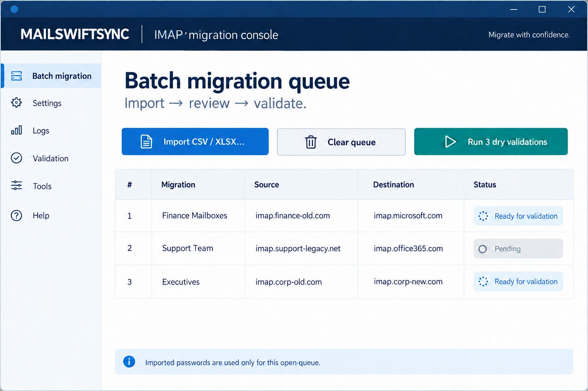

# Bulk migrations from CSV or Excel

Use the **Transient retries** control for short-lived transport failures. MailSwiftSync labels failures as `authentication`, `quota`, `capacity`, `transport`, `configuration`, `message`, or `unknown`; transport and provider-capacity signals such as rate limits, HTTP 429 responses, server-busy responses, and connection ceilings are eligible for retry. Capacity retries use a longer bounded backoff than ordinary transport retries, while exhausted quota, authentication, and configuration errors stop clearly. Backoff is cancellation-aware. For imapsync, message/byte throttle targets are divided across concurrent workers and process starts are globally paced; a finite target must be at least the worker count. These are application-level safeguards, not a substitute for provider-specific tenant limits.

MailSwiftSync can import a migration list from CSV, XLS, or XLSX and process rows with a bounded worker pool. Choose 1–16 concurrent workers to balance migration-window speed against provider throttling. Every mailbox must first complete a matching preflight; after that, the same durable queue can be explicitly promoted to a live batch run. Live execution offers scopes for **Unresolved**, **Failed or Attention only**, **Delta required only**, **Verification differences only**, or **All rows (explicit re-run)**. The default excludes verified rows and operator-review states; use an explicit review scope after inspecting the durable reason, and use the all-rows scope only when deliberately repeating an evidence-backed migration.



> **Workflow preview:** this image illustrates the current batch-review workflow; passwords are never shown in the queue.

## Create the file

Use the header row below. Column names are case-insensitive.

```csv
name,source_host,source_user,source_password,source_credential_id,destination_host,destination_user,destination_password,destination_credential_id
Finance archive,imap.old.example,finance@example.com,,finance-source,imap.new.example,finance@example.com,,finance-destination
```

Required columns are:

- `source_host`
- `source_user`
- `destination_host`
- `destination_user`

Optional columns are `source_password`, `destination_password`, `source_credential_id`, `destination_credential_id`, and `name`. Keyring IDs let each row resolve its own credential without putting secrets in the file. Engine options are trusted application settings and cannot be imported from a spreadsheet. If password columns and keyring IDs are omitted, enter credentials in the masked per-row fields after import. Start from the [CSV template](../bulk-migrations-template.csv) when a protected credential-bearing import is genuinely required.

## Import and review

1. Open **Mailboxes** and choose **Import / edit queue**.
2. Click **Import CSV / Excel…** and select the file.
3. If the file is XLS or XLSX, choose the worksheet containing the migration headers; MailSwiftSync does not assume the first worksheet.
4. Review each source and destination in the queue table and enter any missing credentials in the masked fields.
5. Correct the spreadsheet and import it again if any account is wrong.
6. Choose a conservative concurrency value and click **Run N preflight checks**.
7. Review the resulting `Ready` states and exact plan fingerprints. Select **Live migration**, then click **Run N live migrations** and confirm the destructive-action dialog.

## Run safely

Preflight and live execution are separate deliberate phases. The batch project and all imported mailbox jobs are committed atomically, with a durable parent wave run and one mailbox-specific child run per row. Child runs remain queued until their worker claims the mailbox, then transition to running with the mailbox in one durable operation. A live batch is allowed only when every selected mailbox has a matching successful preflight fingerprint and an operator confirms the queue. Secret-free row configuration is retained so a queue can be restored for review after restart; credentials are intentionally not persisted for replay and must be entered again. Batch startup validates only the selected rows before launching the first process, so credentialless rows that are intentionally excluded do not block a retry. The queue streams indexed output from concurrent workers, supports cancellation and bounded transient retries, and leaves completed/failed/attention child states visible for another delta or retry pass. Each child run retains its engine, launch snapshot, process identity, attempt and terminal result. Live batch verification remains aggregate/engine-dependent; review the exported evidence before declaring the project complete.

Do not commit a spreadsheet containing real passwords or OAuth tokens to Git, and treat the file as sensitive after import. Imported data exists only in MailSwiftSync memory for the current queue and is not written to the saved profile. For operator-managed work, use keyring IDs in the base profile where practical. imapsync OAuth 2.0/XOAUTH2 tokens are supported when configured on the base profile, but provider consent, automatic refresh, and unattended batch secret brokering are not yet implemented.
